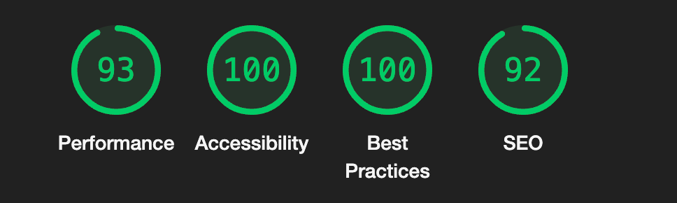

# Portfolio
Personal portfolio containing more information about my work and projects.

This site was created with JS's framework - VUE.js. It allows me to create single page application with static parts and with dynamic /project section where I download from API my latest projects. 

## Tech
- VUE3
- JavaScript
- Sass

## Project
With this project I was able to get friendly with new tool like Figma and with the whole concept of Mobile Design. [View on Figma](https://www.figma.com/file/aVvpjRUkoPahwBNHkT1Xxc/Portfolio-v2?type=design&node-id=0%3A1&mode=design&t=AmMTWVfvjNQjtpsp-1)

## Lighthouse report

