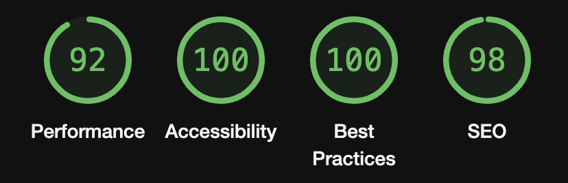

# Portfolio
Welcome to my personal portfolio, a showcase of my work, skills, and ongoing journey in web development. This portfolio is crafted with Vue, Vite, TypeScript, and Sass, reflecting my commitment to staying current with modern web technologies.

## Demo: 
Explore the live version: [ggodek.com](https://www.ggodek.com/)

## Technologies
- Vue.js: `^3.3.11`
- TypeScript: `^5.2.2`
- Sass: `^1.70.0`
- Vite: `^5.0.8`

## Project
This portfolio features a collection of diverse projects created for the sole purpose of learning and expanding my expertise. Each project demonstrates a unique aspect of my skills and highlights my dedication to continuous improvement.

Through the development process, I engaged with various tools, including Figma, to enhance my design and prototyping skills. You can explore the design process on Figma: [View on Figma](https://www.figma.com/file/aVvpjRUkoPahwBNHkT1Xxc/Portfolio-v2?type=design&node-id=0%3A1&mode=design&t=AmMTWVfvjNQjtpsp-1)

## Performance Optimization
The portfolio is optimized for performance, as evidenced by the Lighthouse report below:

Feel free to navigate through the projects and learn more about my journey in web development. If you have any questions or collaboration opportunities, don't hesitate to reach out.

Thank you for visiting!
